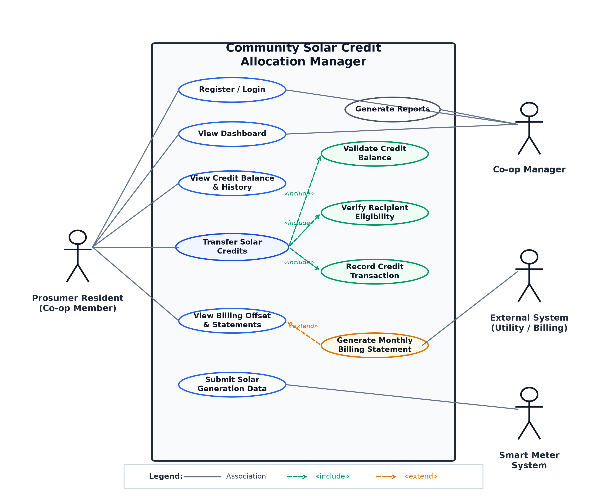
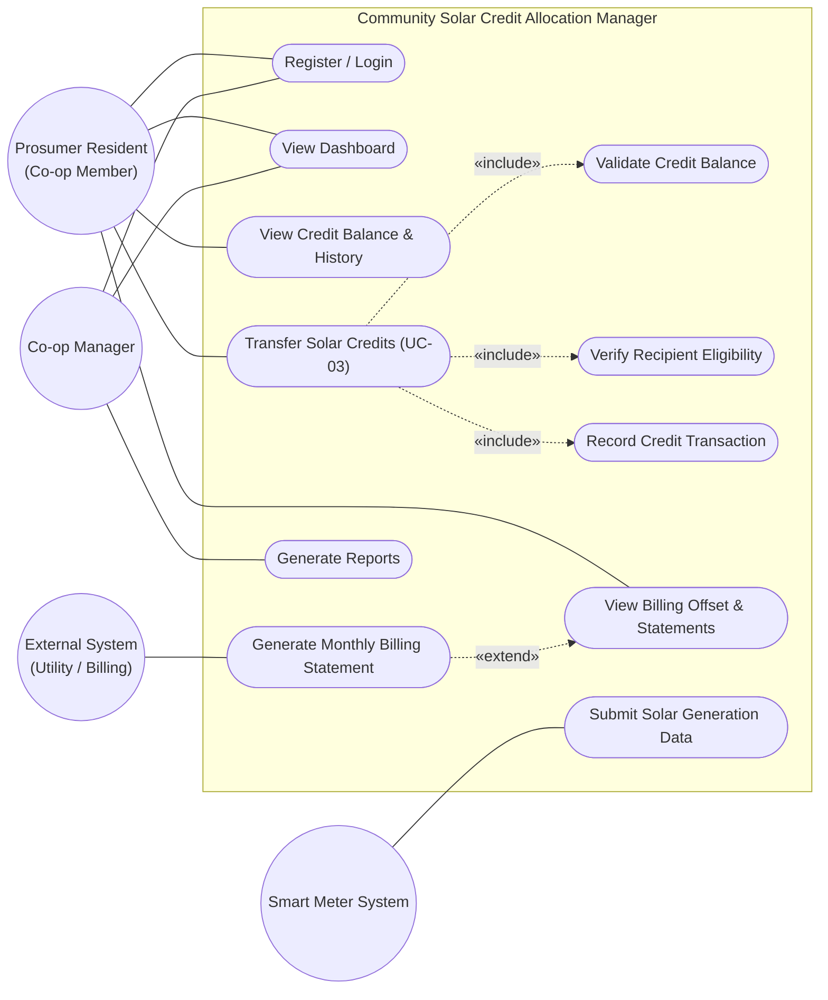

# Lab 1: Requirements Engineering & UML Use-Case Modelling

**Course:** Software Engineering  
**Name:** C Dinesh Kumar  
**SRN:** PES1UG24CS117  
**Section:** 5B  

---

## Project Overview: Community Solar Credit Allocation Manager
**Software Requirements Specification & Use-Case Documentation**

The **Community Solar Credit Allocation Manager** enables prosumers in a residential microgrid cooperative to automatically record solar energy generation via smart meter feeds, monitor balance, allocate surplus solar energy credits to eligible neighboring accounts, and seamlessly track utility billing offsets.

---

## 1. Requirements Traceability Table

| ID | Type | Description | Priority | Acceptance Criteria | Rationale |
| :--- | :--- | :--- | :---: | :--- | :--- |
| **FR-001** | Functional | The system shall record solar generation units (kWh) from smart meter feeds and allow prosumers to transfer surplus credits to neighbor accounts. | **High** | **Pass:** Transferred credits deduct from the prosumer balance and apply to the neighbor billing statement. **Fail:** Transfer exceeding balance. | Enables accurate recording of solar generation and sharing of surplus solar credits. |
| **FR-002** | Functional | The system shall allow prosumer residents to view their available solar credit balance and transaction history. | **High** | **Pass:** The system displays the current credit balance and previous transactions. **Fail:** Incorrect or unavailable balance information is displayed. | Allows prosumers to monitor their available credits and previous transactions. |
| **FR-003** | Functional | The system shall verify that a recipient account is eligible to receive transferred solar credits before completing a credit transfer. | **High** | **Pass:** A transfer proceeds only when the recipient account is valid and eligible. **Fail:** The system rejects transfers to invalid or ineligible recipient accounts. | Prevents credits from being transferred to unauthorized or ineligible community accounts. |
| **FR-004** | Functional | The system shall track monthly utility billing offsets resulting from allocated solar credits. | **High** | **Pass:** The system records and displays the correct billing offset based on allocated solar credits. **Fail:** The displayed billing offset does not reflect the allocated credits. | Enables tracking of the financial benefit obtained through solar credit allocation. |
| **FR-005** | Functional | The system shall allow the Co-op Manager to generate reports on solar generation, credit allocations, and billing offsets. | **Medium** | **Pass:** The Co-op Manager can generate reports containing solar generation, credit allocation, and billing offset information. **Fail:** Required information is missing or inaccurate. | Helps the Co-op Manager monitor and manage community solar activities. |
| **NFR-001** | Performance & Security | The smart meter telemetry processing pipeline must validate and store hourly generation data for 500 households with 99.9% uptime. | **High** | **Pass:** Benchmarking tests confirm the required latency and security standards under simulated peak load. **Fail:** The system fails to meet the required performance or uptime. | Ensures reliable processing of solar generation data at the required scale. |
| **NFR-002** | Non-functional / Security | The system shall ensure that only authorized users can access solar generation, credit, and billing information and perform credit allocation operations. | **High** | **Pass:** All tested unauthorized access attempts to protected information and credit allocation operations are denied. **Fail:** Any unauthorized user can access protected information or perform a restricted operation. | Protects user data and prevents unauthorized credit transactions. |

---

## 2. UML Use-Case Model

### Actors
1. **Prosumer Resident (Co-op Member):** Primary user who generates solar energy, monitors credits, and initiates credit transfers.
2. **Co-op Manager:** Oversees energy allocation, monitors platform statistics, and generates comprehensive cooperative reports.
3. **Smart Meter System:** Automated telemetry device feeding real-time/hourly generation data.
4. **External System (Utility / Billing):** External utility provider consuming credit offset data to update monthly consumer statements.

### Use Case Diagram

---

## 3. Use-Case Flow Specification

### Use Case: Transfer Solar Credits (`UC-03`)

- **Primary Actor:** Prosumer Resident
- **Supporting System:** Community Solar Credit Allocation Manager
- **Goal:** Transfer available solar credits from the prosumer's account to an eligible neighbor's account.

#### Preconditions
1. The Prosumer Resident must be registered and logged into the system.
2. The Prosumer Resident must have available solar credits in their account.
3. The recipient account must be provided by the Prosumer Resident.
4. The requested transfer amount must be greater than zero.

#### Postconditions
1. The transferred credits are deducted from the sender's credit balance.
2. The transferred credits are added to the recipient's account.
3. The credit transfer transaction is recorded in the system.
4. The recipient's billing statement is updated with the transferred credits.
5. A transfer confirmation is displayed to the Prosumer Resident.

#### Main Success Scenario (MSS)
1. The Prosumer Resident selects **Transfer Solar Credits**.
2. The system displays the prosumer's available credit balance.
3. The Prosumer Resident enters the recipient account and the amount of solar credits to transfer.
4. The system verifies that the recipient account is valid and eligible to receive credits.
5. The system checks whether the prosumer has sufficient available credits.
6. The system deducts the specified credits from the sender's balance.
7. The system applies the transferred credits to the recipient's account.
8. The system records the credit transfer transaction.
9. The system updates the recipient's billing statement.
10. The system displays a successful transfer confirmation to the Prosumer Resident.

#### Alternate Flow – Insufficient Credit Balance (A1)
1. **At Step 5**, the system determines that the requested transfer amount exceeds the prosumer's available credit balance.
2. The system rejects the transfer request.
3. The system displays an **Insufficient Credit Balance** message.
4. No credits are deducted from the sender's account.
5. No credits are added to the recipient's account.
6. The transaction is not recorded as a successful transfer.
